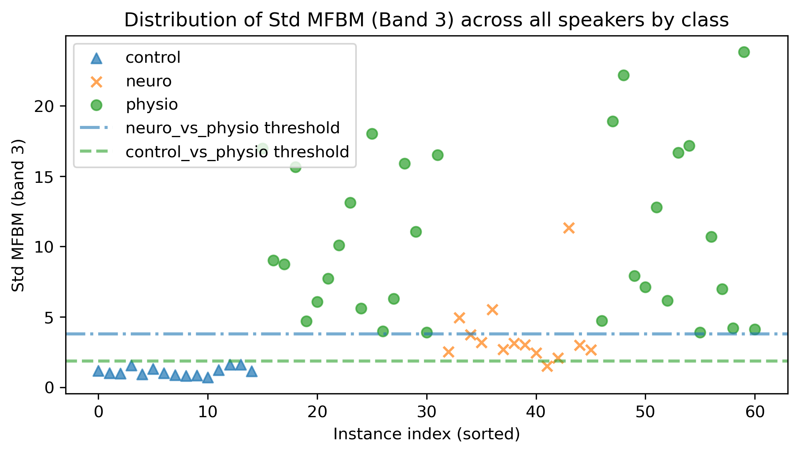

# Mel-Frequency Band Magnitudes for Laryngeal Pathology Discrimination in Speech Signals


This repository contains the code and data associated with the paper:

> **"Bandas espectrais de energia para discriminação de patologias laríngeas em sinais de fala"**<br>
> <i>Spectral energy bands for laryngeal pathologies discrimination in speech signals</i>  
> B. Rodrigues, H. Cordeiro, G. Marques  
> 18th Iberian Conference on Information Systems and Technologies (CISTI), Aveiro, Portugal, June 2023.  
> DOI: https://doi.org/10.23919/CISTI58278.2023.10212052

The work presents a simple threshold-based method to discriminate between healthy and pathological voices, using Mel Filterbank Magnitudes (MFBM) computed from sustained vowel /a/ recordings.

---

## Overview

This work addresses two questions: <br>
> Can Mel Filterbank Magnitudes discriminate between healthy and pathological voice classes, and between pathologies?<br>
> And if so, which mel frequency bands carry the most discriminative information?

The results show that a simple threshold applied to a single Mel band is sufficient to achieve the accuracies below.

Three binary classification tasks are addressed:

| Task | Accuracy | F1-Score |
|------|----------|----------|
| Control vs. Physiological pathologies | 100% | 100% |
| Control vs. Neuromuscular pathologies | 96.55% | 96.30% |
| Physiological vs. Neuromuscular pathologies | 93.48% | 88.0% |

Classification is performed without automatic classifiers. A single decision threshold is applied per task, selected to maximise the F1-score.<br>
The figure below shows the distribution of the standard deviation of MFBM (Band 3) across all speakers. Dashed lines indicate the optimal thresholds obtained for each pairwise classification task.

<p align="center">
  
</p>

---

## Repository Structure

```
├── data/
│   ├── myUSP
│   │   └── myUSP.csv             	# Audio corpus metadata (filename, age, gender, group)
│   └── processed/
│       └── myUSP.parquet           # Pre-extracted MFBM features (no audio signals)
│
├── notebooks/
│   ├── 01_MFBM_extraction.ipynb    # Load audio, extract MFBM, export to parquet
│   └── 02_analysis.ipynb           # Load parquet, reproduce paper results
│
├── results/
│   ├── figures/                    # Plots and visualisations
│   └── metrics/                    # Confusion matrices, accuracy and F1 scores
│
├── src/                            # Source code modules
│
├── .gitignore
├── LICENSE
├── README.md
└── requirements.txt
```

---

## Data

### Audio Corpus (USP)

The audio signals used in this work belong to the **Universidade de São Paulo (USP)** voice corpus, previously used in [1][2]. 
The corpus contains sustained vowel phonation recordings from 61 speakers. Only the sustained vowel /a/ audio files were used:

| Class | Description | N |
|-------|-------------|---|
| control | Healthy speakers | 15 |
| physio | Physiological laryngeal pathologies (Reinke's Edema + Vocal Nodules) | 32 |
| neuro | Neuromuscular laryngeal pathologies (ALS, Huntington's Disease) | 14 |

Signals have a minimum duration of 2 seconds and a sampling rate of 22050 Hz.

The audio files are **not included** in this repository due to distribution restrictions. The file `data/myUSP.csv` contains the metadata (filename, age, gender, pathology group) needed to reconstruct the dataset if you have access to the original corpus.

### Pre-extracted Features

To allow full reproducibility without the audio files, the file `data//processed/myUSP.parquet` contains the pre-extracted MFBM features for all 61 speakers. This file does **not** contain any audio signals.

If you have access to the audio files, notebook `01_MFBM_extraction.ipynb` shows how to reproduce the feature extraction from scratch.

---

## Key Findings

The analysis identified two frequency bands as the most discriminative across all three classification tasks:

- **Band 3 (108–275 Hz):** tipically captures the fundamental frequency and/or its first harmonic
- **Band 8 (603–872 Hz):** corresponds to the first formant of the sustained vowel /a/

Notably, the standard deviation of Band 3 alone proved sufficient to discriminate between all class pairs, suggesting that **vocal instability in the 108–275 Hz range 
is a consistent marker of laryngeal pathology**, regardless of its origin (physiological or neuromuscular).

---

## Method

1. **Pre-processing:** Amplitude normalisation; framing into 30 ms windows with 10 ms step.
2. **Mel Filterbank:** 20 triangular filters with unit area, uniformly spaced on the Mel scale, covering 0–4000 Hz.
3. **Feature extraction:** For each signal, the mean and standard deviation of the filterbank magnitudes are computed across frames, yielding two vectors of 20 values each.
4. **Band selection:** For each pair of classes, the most discriminative band is identified by comparing class means.
5. **Classification:** A decision threshold is applied to the selected band, optimised for F1-Score.

### Note on terminology

The published article refers to the extracted features as "band energies". The implementation uses **filterbank magnitudes** (not energies). 
This discrepancy reflects an evolution of the codebase during the research, and the results reported in the paper were obtained using magnitudes, as implemented here.

### Note on filterbank representation and bands definition

The published article includes a filterbank representation with an **incorrect definition**, assuming a 20% overlap between adjacent filters. The band limits reported in the paper were derived from this incorrect representation.

However, both the original implementation used to obtain the results and the implementation provided in this repository use a Mel filterbank with 50% overlap between filters. Therefore, **the results themselves are based on the correct filterbank configuration**.

This discrepancy originates from the use of an incorrect illustrative filterbank when preparing the article, which led to inconsistencies in the reported band definitions, while the underlying computations remained correct.

---

## Usage

### Requirements

See requirements.txt for dependencies.

### Option A — Starting from pre-extracted features

Open and run `notebooks/02_analysis.ipynb` directly. No audio files required.

### Option B — Starting from audio files

Place the audio files in the expected directory structure:

```
data/
└── myUSP/
    ├── myUSP.csv
    ├── control/
    │   └── *.wav
    ├── edema/
    │   └── *.wav
    ├── nodulo/
    │   └── *.wav
    └── neuro/
        └── *.wav
```

Then run `notebooks/01_MFBM_extraction.ipynb` followed by `notebooks/02_analysis.ipynb`.

---

## Citation

If you use this code or data in your research, please cite:

```bibtex
@inproceedings{rodrigues2023,
  author    = {Rodrigues, Bruno and Cordeiro, Hugo and Marques, Gon{\c{c}}alo},
  title     = {Bandas espectrais de energia para discriminação de patologias laríngeas em sinais de fala},
  booktitle = {18th Iberian Conference on Information Systems and Technologies (CISTI)},
  year      = {2023},
  month     = {June},
  address   = {Aveiro, Portugal},
  isbn      = {978-989-33-4792-8}
}
```

---

## References

[1] H. Cordeiro, C. Meneses, "Parâmetros espectrais de vozes saudáveis e patológicas," CISTI, 2019.

[2] G. A. R. Silva et al., "Diferenciação entre Edema de Reinke e Nódulos Vocais através de Parâmetros Não-Lineares da Voz," SBRT, 2021.

---

## License

This project is licensed under the MIT License — see the [LICENSE](LICENSE) file for details.
